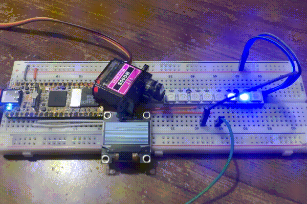
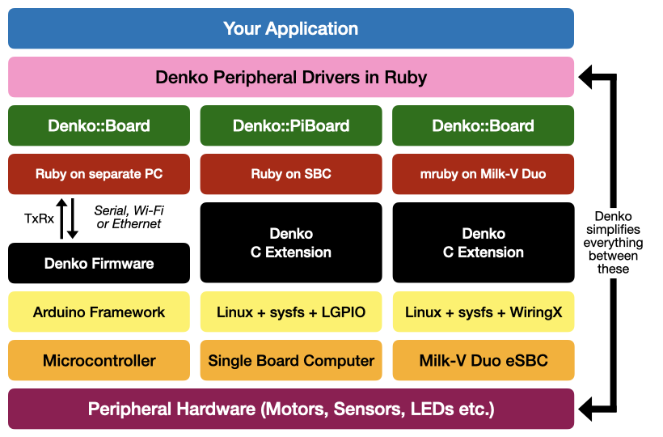

# denko
[](https://github.com/denko-rb/denko/actions/workflows/ruby.yml)



Program real-life electronics in Ruby. LEDs, buttons, sensors (and more) work just like any Ruby object:

```ruby
led.blink 0.5

lcd.text "Hello World!"

reading = sensor.read

button.down { puts "Button pressed!" }
button.listen
```

## How It Works



Denko aims to provide a Ruby API for you to directly control physical peripherals, while abstracting all the hardware and software complexity in between. There are currently 3 supported "stacks":

### Connected Microcontroller
- Flash a [supported microcontroller](MICROCONTROLLERS.md) with the Denko firmware
- Connect it to a PC running Ruby, over Serial, Ethernet, or Wi-Fi
- The microcontroller does the "low-level" signal work, appearing as an instance of `Denko::Board` in Ruby
- Ruby peripheral drivers, running on the PC, do the "high-level" work

### Single-Board-Computer
- Install [denko-piboard](https://github.com/denko-rb/denko-piboard) on a Linux SBC
- The included C extension makes the SBC's GPIO header available via a `Denko::PiBoard` instance
- Use it in Ruby programs, self-contained on the SBC

### mruby on Milk-V Duo
- Download `mruby` and/or `mirb` binaries from the [mruby-denko-milkv-duo](https://github.com/denko-rb/mruby-denko-milkv-duo) repo onto your Milk-V Duo
- Everything is included. Instances of `Denko::Board` in mruby will use the Milk-V's GPIO

**Notes:**
- Peripheral drivers are implemented __only__ in this gem, and the source files are used by __all__ stacks
- That makes the [examples folder](examples) in this gem relevant to all (ignoring hardware incompatibilities)
- If using `denko-piboard` or `mruby-denko-milkv-duo`, ignore the hardware and installation sections here

## Supported Hardware
- [Peripherals](PERIPHERALS.md)
- [Microcontrollers](MICROCONTROLLERS.md)
- [Single Board Computers](https://github.com/denko-rb/denko-piboard?tab=readme-ov-file#support)
- [Milk-V Duo Boards](https://github.com/denko-rb/mruby-denko-milkv-duo?tab=readme-ov-file#supported-hardware)

## Installation

**Note:** On Windows, you can follow the Mac/Linux instructions in WSL, but it isn't recommended. Serial (COM port) forwarding doesn't work reliably on WSL2, preventing communication with the board. While there are workarounds (and it might work on WSL1), we recommend using the [RubyInstaller for Windows](https://rubyinstaller.org/) with the Arduino IDE instead. Alternatively, a Linux virtual machine with USB passthrough also works.

#### 1. Install the Gem

```console
gem install denko
```

#### 2. Install the Arduino IDE OR CLI

Get the Arduino IDE [here](http://arduino.cc/en/Main/Software) for a graphical interface (recommended for Windows), or use the command line interface from [here](https://github.com/arduino/arduino-cli/releases) or via Homebrew.

**CLI Installation with Homebrew on Mac or Linux:**

```console
brew update
brew install arduino-cli
```

#### 3. Install Arduino Dependencies

Denko uses Arduino cores, which support different microcontrollers, and a few libraries. Install only the ones for your microcontroller, or install everything. There are no conflicts. Instructions:

- [Install Dependencies in IDE](DEPS_IDE.md)
- [Install Dependencies in CLI](DEPS_CLI.md)

#### 4. Generate the Arduino Sketch

The `denko` command is included with the gem. It will make the Arduino sketch folder for you, and configure it.

**Example for ESP32 target on both serial and Wi-Fi:**

```console
denko sketch serial --target esp32
denko sketch wifi --target esp32 --ssid YOUR_SSID --password YOUR_PASSWORD

# For more options
denko targets
```

**Note:** Boards flashed with a Wi-Fi or Ethernet sketch will [listen for a TCP connection](examples/connection/tcp.rb) but fall back to Serial when there is none active.

#### 5a. IDE Flashing

- Connect the board to your computer with a USB cable.
- Open the .ino file inside your sketch folder with the IDE.
- Open the dropdown menu at the top of the IDE window, and select your board.
- Press the Upload :arrow_right: button. This will compile the sketch, and flash it to the board.

**Troubleshooting:**

- If your serial port is in the list, but the board is wrong, select the serial port anyway, then you can manually select a board.
- If your board doesn't show up at all, make sure it is connected properly. Try disconnecting and reconnecting, use a different USB port or cable, or press the reset button after plugging it in.
- Some boards can get into a state where you have to hold their "boot" button while cycling power (reconnect or reset) for them to enter firmware update mode. Eg. Raspberry Pi Pico, ESP32-S2/S3.

#### 5b. CLI Flashing

- The path output by `denko sketch` earlier is your sketch folder. Keep it handy.
- Connect the board to your computer with a USB cable.
- Check if the CLI recognizes it:

```console
arduino-cli board list
```

- Using the Port and FQBN (Fully Qualified Board Name) shown, compile and upload the sketch:

```console
arduino-cli compile -b YOUR_FQBN YOUR_SKETCH_FOLDER
arduino-cli upload -v -p YOUR_PORT -b YOUR_FQBN YOUR_SKETCH_FOLDER
```

**Troubleshooting:**

- Follow the same steps as the IDE method above. List all FQBNs using:

```console
arduino-cli board listall
```

#### 6. Test It

Most boards have a regular LED on board. Test with the [blink](examples/led/builtin_blink.rb) example. If you have an on-board WS2812 LED (Neopixel), use the [WS2812 blink](examples/led/ws2812_builtin_blink.rb) example instead. If it starts blinking, you're ready for Ruby!

## Examples and Tutorials

#### Tutorial

- [Here](tutorial) you will find a beginner-friendly tutorial that goes through the basics, using commented examples and diagrams. Read the comments and try modifying the code. You will need the following:
  - 1 [compatible microcontroller](MICROCONTROLLERS.md)
  - 1 button or momentary switch
  - 1 potentiometer (any value)
  - 1 external RGB LED (4 legs common cathode, not a Neopixel or individually addressable)
  - 1 external LED (any color, or use one color from the RGB LED)
  - Current limiting resistors for LEDs
  - Breadboard
  - Jumper wires

  **Tip:** Kits are a good way to get started. They include even more, and get you well beyond the tutorial.

#### Included Examples

- The [examples](examples) folder contains at least one example per peripheral, demonstrating its interface.
- Each example should include a wiring diagram alongside its code (still incomplete).
