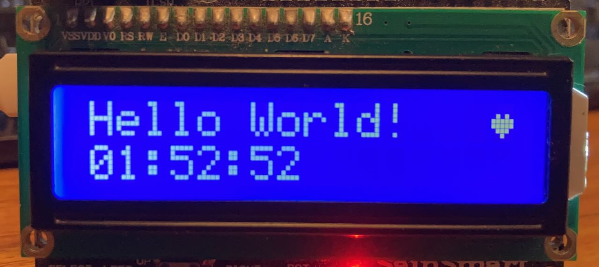
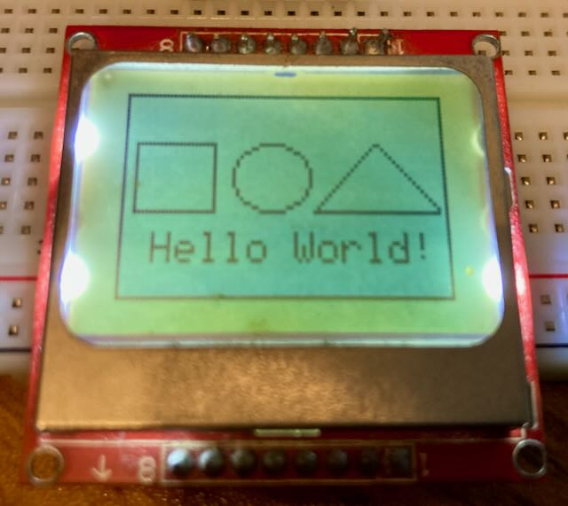
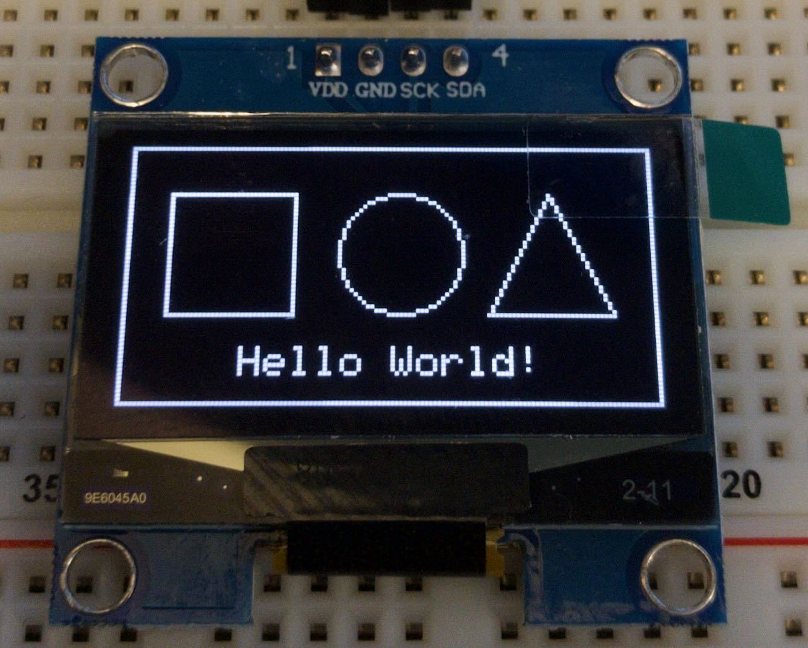
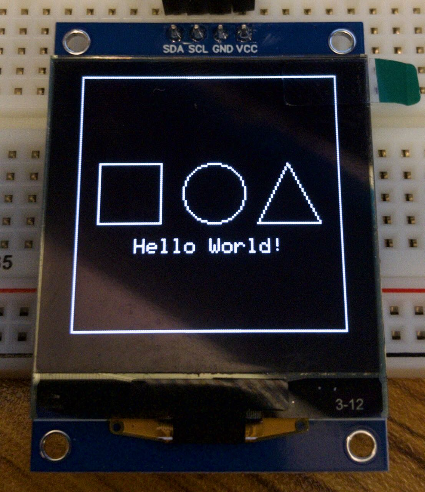
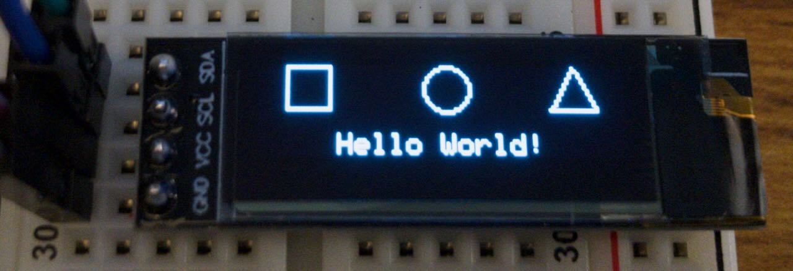
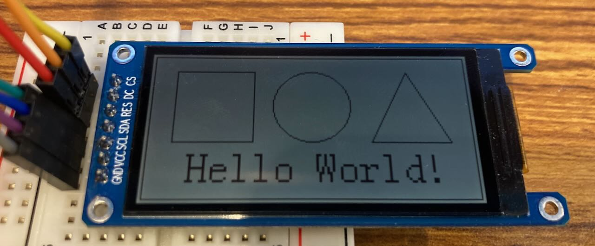
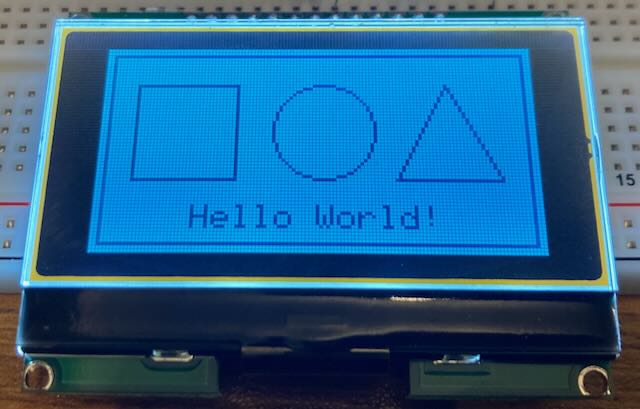

# Supported Displays

## HD44780

**Type:** Backlit Character LCD\
**Colors:** Mono, multiple colors available\
**Size:** Multiple sizes available\
**Characters:** 16x02, 20x04\
**Interface:** Digital Output

## PCD8544

**Type:** Backlit LCD\
**Colors:** Mono\
**Size:** 1.4 inch viewable\
**Pixels:** 84 x 48\
**Interface:** SPI

## SH1106

**Type:** OLED\
**Colors:** Mono, multiple colors available\
**Size:** Multiple sizes available, 0.96 to 2.42 inch most common\
**Pixels:** 128 x 64\
**Interface:** I2C and SPI versions available

## SH1107

**Type:** OLED\
**Colors:** Mono\
**Size:** 1.5"\
**Pixels:** 128 x 128\
**Interface:** I2C and SPI versions available

## SSD1306

**Type:** OLED\
**Colors:** Mono, multiple colors available\
**Size:** Multiple sizes available, 0.9 to 2.42 inch most common\
**Pixels:** Multiple sizes, 128 x 64 and 128 x 32 most common\
**Interface:** I2C and SPI versions available

## ST7302

**Type:** Reflective LCD\
**Colors:** Mono\
**Size:** 2.13 inch\
**Pixels:** 250 x 122\
**Interface:** SPI

## ST7565

**Type:** Backlit LCD\
**Colors:** Mono\
**Size:** 2.1 inch viewable\
**Pixels:** 128 x 64\
**Interface:** SPI
