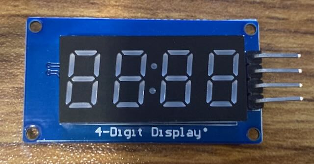
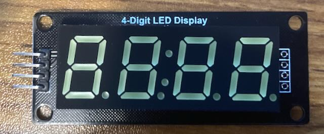

# Supported LEDs

## Seven Segment

### TM1637

**Type:** Seven Segment Array\
**Colors:** Multiple colors available\
**Size:** Multiple sizes available\
**Digits:** 4 + colon (decimal points not connected on modules tested)\
**Interface:** Custom Bit-Bang over Digital Output
